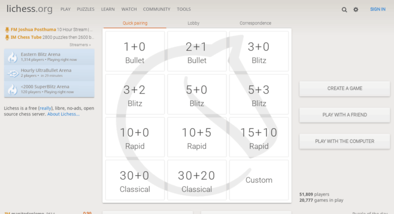
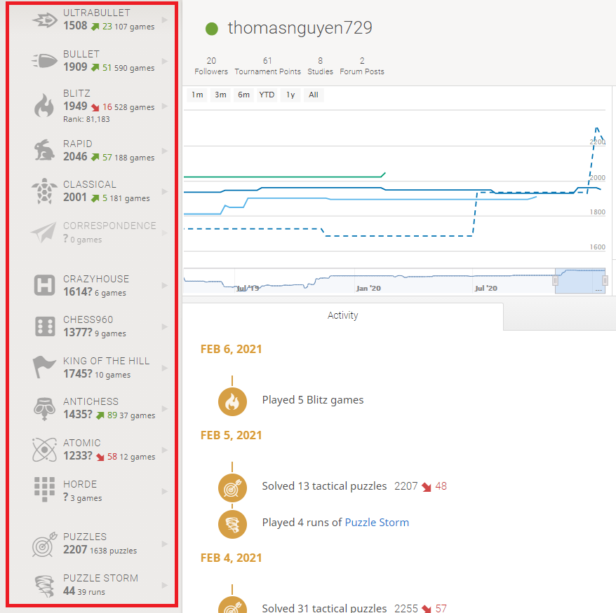
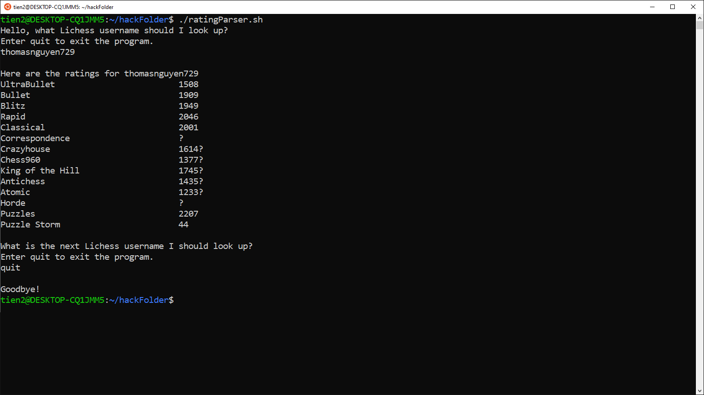

# A Lichess Rating Parser

Are you a chess player? If so, you may be familar with an online chess community called Lichess.

Homepage of the Lichess Website.

# The Problem

In the image above, the text highlighted in red are different game modes and ratings. A ? means that a player has not played enough games to receive a rating.

As a chess enthusiast, I am interested in seeing the ratings of the top players. However, it is an inconvenience to switch from each player's rating page. 

# The Solution
To deal with this issue, I created a program that takes a username and outputs their current rating on Lichess.

This program allows users to continuously enter Lichess usernames and see their chess ratings. 
 
Now, I can quickly look at many players' ratings without even touching the mouse.
